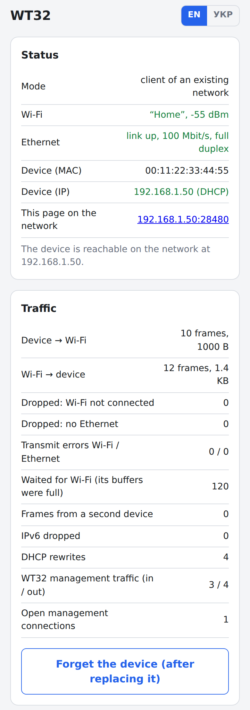
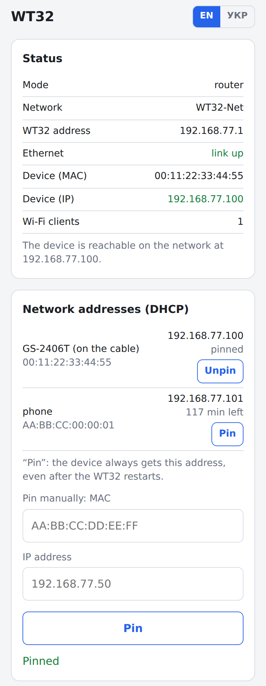
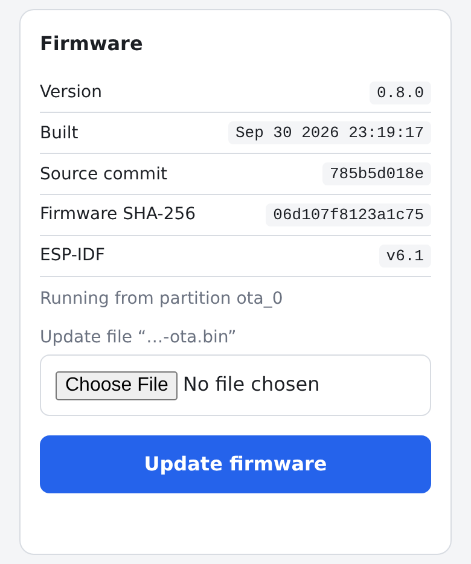
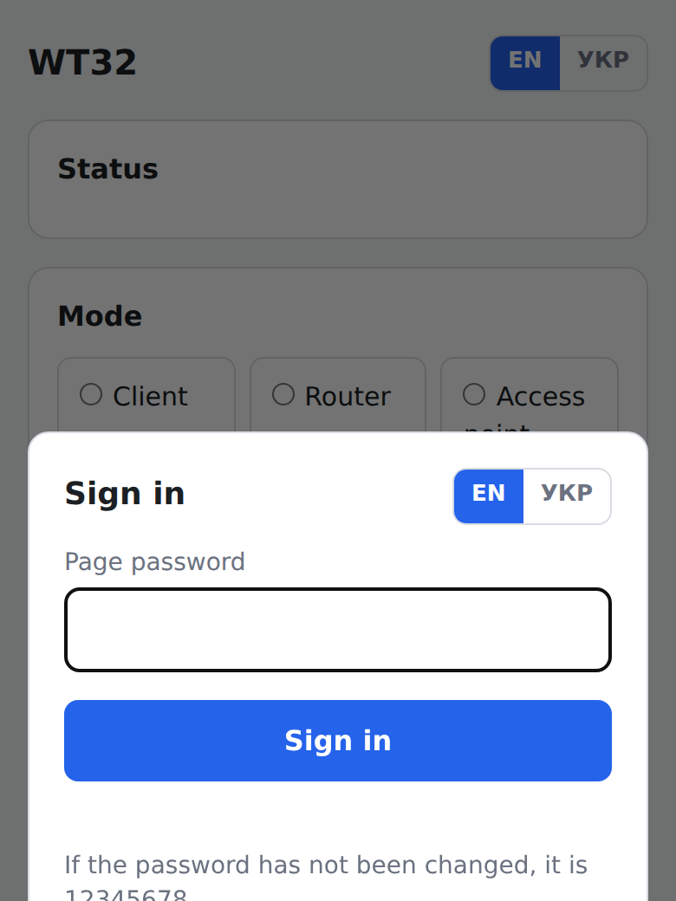
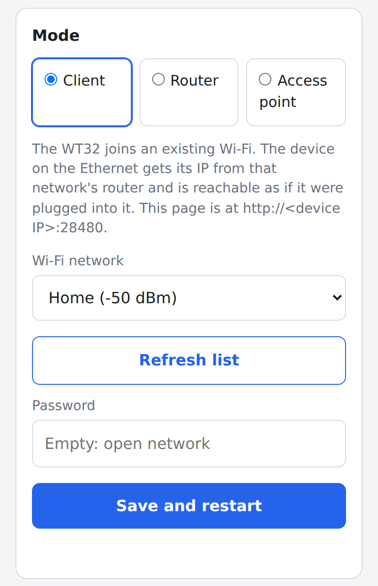
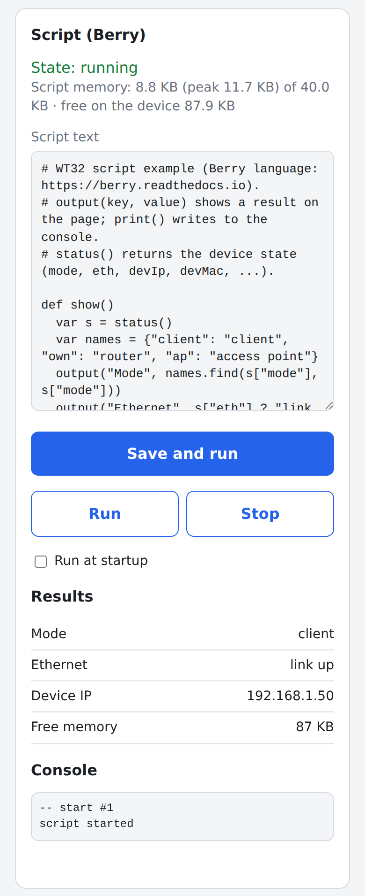
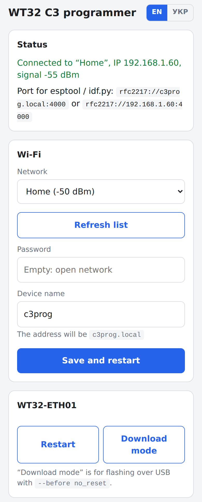
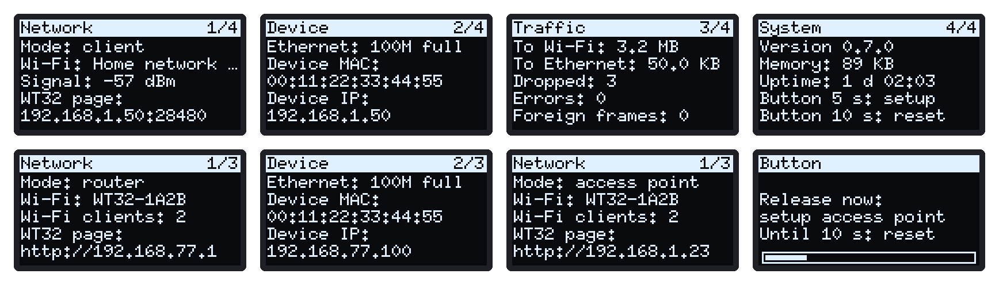
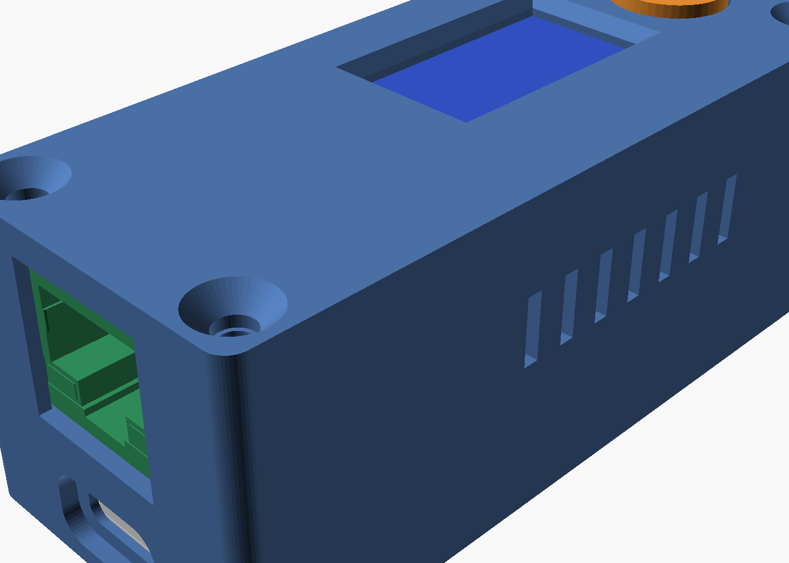

# WT32-ETH01: Wi-Fi for an Ethernet-only device

*[Українська](README_UA.md)*

Firmware for the **WT32-ETH01** (ESP32 + LAN8720) that gives Wi-Fi to a device with only an Ethernet port (a printer, a controller, a NAS, a camera, …), or shares the network on its cable over Wi-Fi. The firmware knows nothing about the device and never changes its data: it only forwards frames.

> **Status:** everything builds (ESP-IDF 6.1) and passes the tests on a PC: frame handling and DHCP in C with sanitizers, the web pages in a browser against a mock of the device API. **On hardware** so far: the C3 programmer (flashing and the log over Wi-Fi) and the Client mode basics — the device on the network, ping, normal use, the WT32 page on the management port. The rest is not verified yet; the checklist with results is in [`wt32/README.md`](wt32/README.md#3-checklist-with-a-device).

<p>



</p>

## What it does

| Mode | How it works | WT32 page |
|---|---|---|
| **Client** (default) | The WT32 joins your Wi-Fi. The device gets its IP from your router and is reachable as if it were plugged into it | `http://<device IP>:28480` |
| **Router** | The WT32 runs its own Wi-Fi with DHCP. The device and phones share one network, no internet | `http://192.168.77.1` |
| **Access point** | The WT32's cable goes into a router; the WT32 shares that network over Wi-Fi | `http://wt32.local` |

- **Client mode** works with one device: an 802.11 station can only use its own MAC, so the WT32 sends the device's frames under its station MAC and rewrites the MACs inside ARP and DHCP. The router sees one client. The WT32 shares the device's IP and takes only the connections to its management port, so everything else (the device's own web page, printing, ping) reaches the device.
- **Router mode** has its own DHCP server: a phone keeps its address, addresses can be pinned to a MAC from the page, leases survive a restart.
- **Access point mode** passes the router's DHCP through. If there is no DHCP on the cable for 30 s, the WT32 takes a fallback address and serves its own Wi-Fi clients, so the page stays reachable; it goes back as soon as the router answers.

## Features

- **Web page** in **English and Ukrainian** (switch in the header and on the login form). Adding a language takes JSON files only (see [Languages](#languages)). The page shows per-mode status, traffic counters, DHCP clients and pins, and the settings. It is password-protected (default `12345678`), with sessions and a lockout after failed attempts.
- **Firmware info and update** on the page: version, build date and time, source commit, SHA-256 of the image, ESP-IDF version. An update is checked before any flash write, and the device rolls back if the new firmware does not come up within 60 s.
- **Scripts in [Berry](https://github.com/berry-lang/berry)**, edited on the page: read the device status, show results on the page and the display, and run on timers. Scripts have memory and time limits, and a crashing script turns its autostart off.
- **Display and button** (optional): 0.96″ SSD1306 OLED with pages per mode, in the language chosen on the page. The button has three actions: a short press shows the next page, a 5 s press starts setup once, and a 10 s press resets.
- **C3 programmer**: an ESP32-C3 SuperMini flashes the WT32 and reads its log over Wi-Fi (`esptool -p rfc2217://c3prog.local:4000`) or over USB. It has its own page, in the same two languages.
- **3D-printable case** for the WT32, the display, the button and USB-C power, generated in code and checked against the board's 3D model.

## Screenshots

The pages at phone width (taken against the test mock; [`docs/img/screenshots.js`](docs/img/screenshots.js) regenerates them):

| Login | Mode | Script | C3 programmer |
|---|---|---|---|
|  |  |  |  |

In Ukrainian: [login](docs/img/login_uk.png), [client](docs/img/client_uk.png), [router](docs/img/router_uk.png), [mode](docs/img/mode_uk.png), [script](docs/img/script_uk.png), [firmware](docs/img/firmware_uk.png), [C3](docs/img/c3_uk.png).

The display (rendered by the host test; it follows the language chosen on the page, [Ukrainian](docs/img/display_uk.png)): the Client pages (network, device, traffic, system), then Router, Access point, and the button held past 5 s:



| Case | Wiring |
|---|---|
|  |  |

## Hardware

| Part | Needed for |
|---|---|
| WT32-ETH01 | everything |
| ESP32-C3 SuperMini + 6 wires | flashing and the log over Wi-Fi (or any USB-UART adapter) |
| 0.96″ I2C OLED SSD1306, 128×64 | optional display |
| a push button | optional (page, setup start, reset) |
| USB-C "power only" breakout | power in the case |

## Quick start

1. Flash the C3 with [`tools/c3-programmer/firmware/c3-programmer.bin`](tools/c3-programmer/firmware/) at `0x0` (e.g. from the browser with [esptool-js](https://espressif.github.io/esptool-js/)) and connect it to Wi-Fi through the `C3prog-Setup-XXXX` access point.
2. Wire the C3 to the WT32 and flash it (diagrams and the first flash step by step: [`docs/WIRING.md`](docs/WIRING.md)):
   ```bash
   esptool.py --chip esp32 -p rfc2217://c3prog.local:4000 erase_flash
   esptool.py --chip esp32 -p rfc2217://c3prog.local:4000 write_flash 0x0 wt32/firmware/wt32-bridge.bin
   ```
3. Connect a phone to `WT32-Setup-XXXX`, log in with `12345678`, choose the mode and the network, and change the password.

Later updates go through the page: **Firmware** → `wt32/firmware/wt32-bridge-ota.bin`.

## Layout

| Folder | What it is |
|---|---|
| [`wt32/`](wt32/) | the WT32-ETH01 firmware; prebuilt images in `wt32/firmware/`; modes, page, display, scripts, checklist: [`wt32/README.md`](wt32/README.md) |
| [`tools/c3-programmer/`](tools/c3-programmer/) | ESP32-C3 SuperMini as a programmer and serial monitor for the WT32 (RFC2217 over Wi-Fi, USB) |
| [`shared/wifi_setup/`](shared/wifi_setup/) | shared component: Wi-Fi with settings in NVS, setup access point with a captive portal, web API, page password, languages, firmware info and OTA |
| [`shared/script_berry/`](shared/script_berry/) | user scripts in Berry: editor on the page, memory and time limits |
| [`hardware/case/`](hardware/case/) | 3D-printable case: STL files and the Python generator with its checks |
| [`docs/WIRING.md`](docs/WIRING.md) | wiring diagrams and the first flash |
| [`docs/ARCHITECTURE.md`](docs/ARCHITECTURE.md) | decisions, stages, open questions |

## Languages

Each part keeps its page texts in `i18n/<code>.json` files (`en.json`, `uk.json`), and the build compiles them into the firmware. To add a language, add `<code>.json` next to `en.json` in the folders of the app (for the WT32: `wt32/main/i18n`, `shared/wifi_setup/i18n`, `shared/script_berry/i18n`) and rebuild. The switch shows the new language on its own, and any text still missing appears in English. Details: [`wt32/README.md`](wt32/README.md#languages).

## Building

After cloning: `git submodule update --init` (Berry). ESP-IDF ≥ 6.0 (tested with 6.1). In `wt32/` and `tools/c3-programmer/`, `./build_firmware.sh` does a clean build and produces a full image for `0x0` and a `…-ota.bin` for the page. The tests are listed in [`wt32/README.md`](wt32/README.md#tests-on-a-pc).

## Credits

Written from scratch; inspired by and built on ideas from:

- [martin-ger/esp32_eth_wifi_bridge](https://github.com/martin-ger/esp32_eth_wifi_bridge) by Martin Gergeleit: the original ESP32 Ethernet ↔ Wi-Fi AP bridge this project started from. The Router and Access point modes use the same idea (an lwIP bridge of Ethernet and the AP), re-implemented here;
- [martin-ger/esp32_nat_router](https://github.com/martin-ger/esp32_nat_router), which that project grew out of;
- the ESP-IDF example [`examples/network/sta2eth`](https://github.com/espressif/esp-idf/tree/master/examples/network/sta2eth): rewriting the device's MAC to the station's, used in Client mode;
- [egnor/wt32-eth01](https://github.com/egnor/wt32-eth01): notes on the WT32-ETH01 and its 3D model, which the case checks use (downloaded at build time, not included).

Third-party parts keep their own licenses: [Berry](https://github.com/berry-lang/berry) (MIT, git submodule), the misc-fixed 6×10 font (public domain, via [u8g2](https://github.com/olikraus/u8g2)); ESP-IDF, esp-protocols (mdns), esp-eth-drivers and rfc2217-server (Apache-2.0) are fetched at build time.

## License

[MIT](LICENSE).
