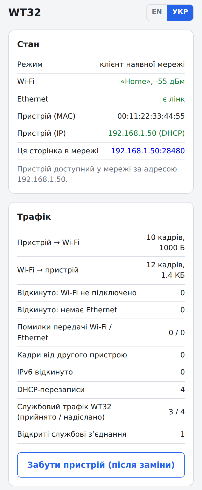
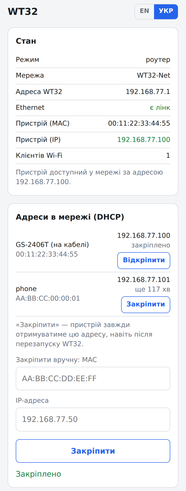
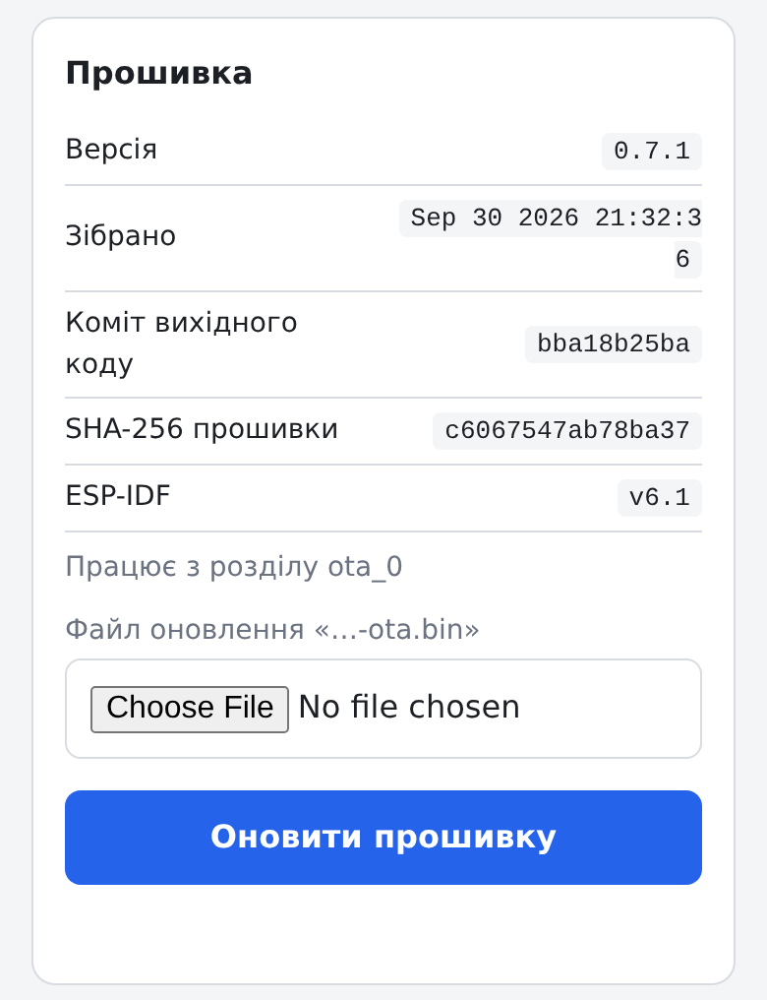
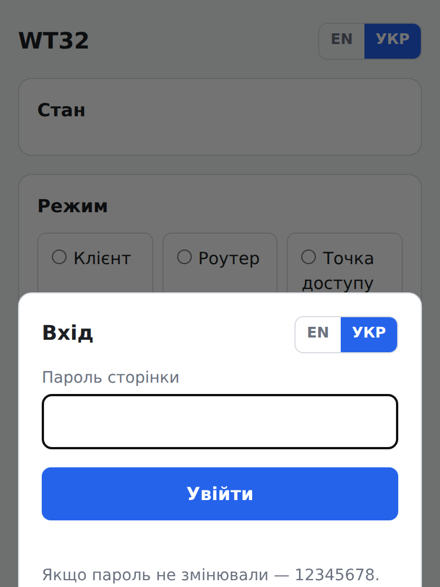
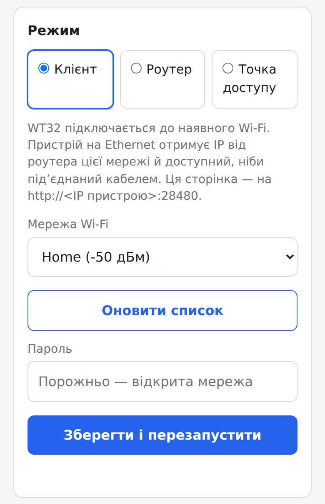
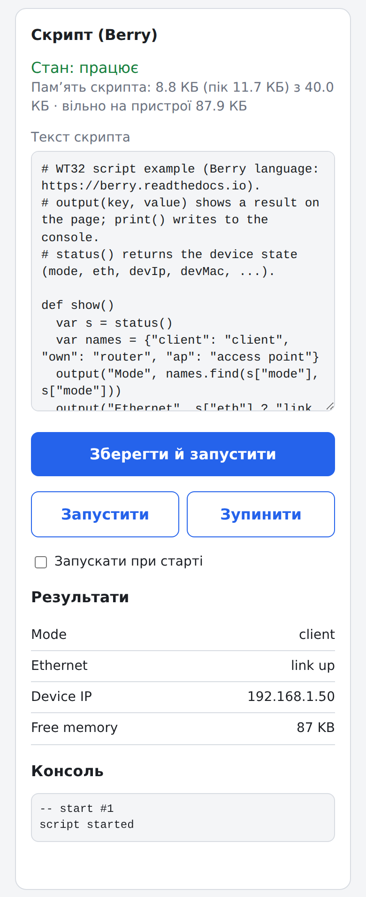
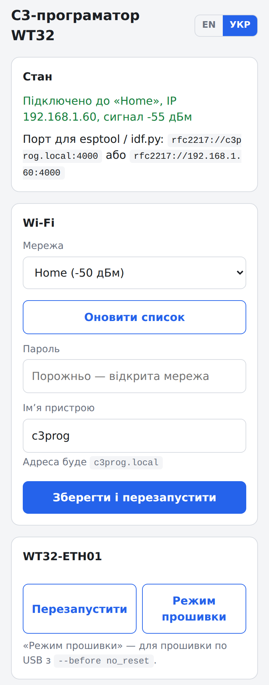
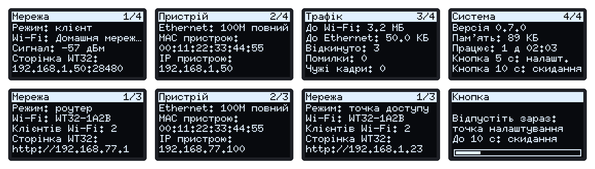

# WT32-ETH01: Wi-Fi для пристрою лише з Ethernet

*[English](README.md)*

Прошивка для **WT32-ETH01** (ESP32 + LAN8720), яка дає Wi-Fi пристрою з одним лише Ethernet-портом (принтеру, контролеру, NAS, камері тощо) або роздає по Wi-Fi мережу з кабелю. Прошивка нічого не знає про сам пристрій і не змінює його дані: вона лише пересилає кадри.

> **Статус:** усе збирається (ESP-IDF 6.1) і проходить тести на ПК: обробка кадрів і DHCP — на C із санітайзерами, веб-сторінки — у браузері проти імітації API пристрою. **На залізі** поки перевірено: C3-програматор (прошивка й лог через Wi-Fi) і основу режиму «Клієнт» — пристрій у мережі, ping, звична робота, сторінка WT32 на службовому порту. Решту ще не перевірено; чекліст з результатами — у [`wt32/README_UA.md`](wt32/README_UA.md#3-чекліст-перевірки-з-пристроєм).

<p>



</p>

## Що робить

| Режим | Як працює | Сторінка WT32 |
|---|---|---|
| **Клієнт** (за замовчуванням) | WT32 підключається до вашого Wi-Fi. Пристрій отримує IP від вашого роутера й доступний, ніби під'єднаний до нього кабелем | `http://<IP пристрою>:28480` |
| **Роутер** | WT32 роздає власний Wi-Fi з DHCP. Пристрій і телефони — в одній мережі, без інтернету | `http://192.168.77.1` |
| **Точка доступу** | кабель WT32 — у роутер; WT32 роздає його мережу по Wi-Fi | `http://wt32.local` |

- **Клієнт** працює з одним пристроєм: Wi-Fi-станція може використовувати лише власну MAC, тож WT32 надсилає кадри пристрою під своєю MAC станції й переписує MAC усередині ARP і DHCP. Роутер бачить одного клієнта. WT32 ділить IP пристрою і забирає собі лише зʼєднання на свій службовий порт, тож усе інше (власна сторінка пристрою, друк, ping) доходить до пристрою.
- **Роутер** має власний DHCP-сервер: телефон зберігає свою адресу, адреси можна закріпити за MAC на сторінці, оренди переживають перезапуск.
- **Точка доступу** пропускає DHCP роутера. Якщо на кабелі 30 с немає DHCP, WT32 бере запасну адресу й сам роздає адреси своїм Wi-Fi-клієнтам, щоб сторінка лишалась доступною; щойно роутер відповість — повертається до нього.

## Можливості

- **Веб-сторінка** **англійською та українською** (перемикач у заголовку і на формі входу). Щоб додати мову, досить JSON-файлів (див. [Мови](#мови)). Сторінка показує стан для кожного режиму, лічильники трафіку, DHCP-клієнтів і закріплення, а також налаштування. Вона захищена паролем (за замовчуванням `12345678`), має сесії й блокування після невдалих спроб.
- **Дані прошивки й оновлення** на сторінці: версія, дата й час збірки, коміт вихідників, SHA-256 образу, версія ESP-IDF. Оновлення перевіряється до будь-якого запису у флеш, а якщо нова прошивка не запуститься за 60 с, пристрій повертає попередню.
- **Скрипти мовою [Berry](https://github.com/berry-lang/berry)** редагуються на сторінці: читають стан пристрою, показують результати на сторінці й екрані, запускаються за таймерами. Скрипти мають ліміти памʼяті й часу, а скрипт, що впав, вимикає свій автозапуск.
- **Екран і кнопка** (необовʼязково): OLED SSD1306 0,96″ зі сторінками для кожного режиму, мовою, обраною на сторінці. Кнопка має три дії: коротке натискання показує наступну сторінку, 5 с — разовий запуск налаштування, 10 с — скидання.
- **C3-програматор**: ESP32-C3 SuperMini прошиває WT32 і читає її лог через Wi-Fi (`esptool -p rfc2217://c3prog.local:4000`) або USB. Має власну сторінку тими самими двома мовами.
- **Корпус для 3D-друку** для WT32, екрана, кнопки й живлення USB-C; згенерований кодом і звірений з 3D-моделлю плати.

## Знімки екрана

Сторінки на ширині телефона (знято проти тестової імітації; [`docs/img/screenshots.js`](docs/img/screenshots.js) перезнімає їх):

| Вхід | Режим | Скрипт | C3-програматор |
|---|---|---|---|
|  |  |  |  |

Англійською: [вхід](docs/img/login_en.png), [клієнт](docs/img/client_en.png), [роутер](docs/img/router_en.png), [режим](docs/img/mode_en.png), [скрипт](docs/img/script_en.png), [прошивка](docs/img/firmware_en.png), [C3](docs/img/c3_en.png).

Екран (намальований тестом на ПК; мовою, обраною на сторінці, [англійською](docs/img/display_en.png)): сторінки режиму «Клієнт» (мережа, пристрій, трафік, система), далі «Роутер», «Точка доступу» і кнопка, утримувана понад 5 с:



| Корпус | Підключення |
|---|---|
|  |  |

## Залізо

| Що | Для чого |
|---|---|
| WT32-ETH01 | усе |
| ESP32-C3 SuperMini + 6 дротів | прошивка й лог через Wi-Fi (або будь-який USB-UART) |
| OLED 0,96″ I2C SSD1306, 128×64 | необовʼязковий екран |
| кнопка | необовʼязково (сторінки, запуск налаштування, скидання) |
| перехідник USB-C «лише живлення» | живлення в корпусі |

## Швидкий старт

1. Прошити C3 файлом [`tools/c3-programmer/firmware/c3-programmer.bin`](tools/c3-programmer/firmware/) з адреси `0x0` (наприклад, з браузера через [esptool-js](https://espressif.github.io/esptool-js/)) і підключити його до Wi-Fi через точку `C3prog-Setup-XXXX`.
2. З'єднати C3 з WT32 і прошити її (схеми й перша прошивка крок за кроком: [`docs/WIRING_UA.md`](docs/WIRING_UA.md)):
   ```bash
   esptool.py --chip esp32 -p rfc2217://c3prog.local:4000 erase_flash
   esptool.py --chip esp32 -p rfc2217://c3prog.local:4000 write_flash 0x0 wt32/firmware/wt32-bridge.bin
   ```
3. Телефоном підключитися до `WT32-Setup-XXXX`, увійти з паролем `12345678`, вибрати режим і мережу, змінити пароль.

Наступні оновлення — через сторінку: **Прошивка** → `wt32/firmware/wt32-bridge-ota.bin`.

## Структура

| Тека | Що це |
|---|---|
| [`wt32/`](wt32/) | прошивка WT32-ETH01; готові образи в `wt32/firmware/`; режими, сторінка, екран, скрипти, чекліст — [`wt32/README_UA.md`](wt32/README_UA.md) |
| [`tools/c3-programmer/`](tools/c3-programmer/) | ESP32-C3 SuperMini як програматор і послідовний монітор для WT32 (RFC2217 через Wi-Fi, USB) |
| [`shared/wifi_setup/`](shared/wifi_setup/) | спільний компонент: Wi-Fi з налаштуваннями в NVS, точка налаштування з captive portal, веб-API, пароль сторінки, мови, дані прошивки й OTA |
| [`shared/script_berry/`](shared/script_berry/) | скрипти користувача мовою Berry: редактор на сторінці, ліміти памʼяті й часу |
| [`hardware/case/`](hardware/case/) | корпус для 3D-друку: STL-файли і генератор на Python з перевірками |
| [`docs/WIRING_UA.md`](docs/WIRING_UA.md) | схеми підключення і перша прошивка |
| [`docs/ARCHITECTURE_UA.md`](docs/ARCHITECTURE_UA.md) | рішення, етапи, відкриті питання |

## Мови

Кожна частина тримає тексти сторінки у файлах `i18n/<code>.json` (`en.json`, `uk.json`), а збірка вкомпільовує їх у прошивку. Щоб додати мову, покладіть `<code>.json` поруч із `en.json` у теках застосунку (для WT32: `wt32/main/i18n`, `shared/wifi_setup/i18n`, `shared/script_berry/i18n`) і перезберіть. Перемикач сам покаже нову мову, а тексти, яких ще бракує, будуть англійською. Подробиці: [`wt32/README_UA.md`](wt32/README_UA.md#мови).

## Збірка

Після клонування: `git submodule update --init` (Berry). ESP-IDF ≥ 6.0 (перевірено на 6.1). У `wt32/` і `tools/c3-programmer/` команда `./build_firmware.sh` робить чисту збірку: повний образ для `0x0` і `…-ota.bin` для сторінки. Тести — у [`wt32/README_UA.md`](wt32/README_UA.md#тести-на-пк).

## Подяки

Написано з нуля, з натхненням від цих проєктів і на основі їхніх ідей:

- [martin-ger/esp32_eth_wifi_bridge](https://github.com/martin-ger/esp32_eth_wifi_bridge) (Martin Gergeleit): оригінальний міст ESP32 Ethernet ↔ Wi-Fi AP, з якого почався цей проєкт. Режими «Роутер» і «Точка доступу» використовують ту саму ідею (lwIP-міст Ethernet і AP), реалізовану тут заново;
- [martin-ger/esp32_nat_router](https://github.com/martin-ger/esp32_nat_router), з якого виріс той проєкт;
- приклад ESP-IDF [`examples/network/sta2eth`](https://github.com/espressif/esp-idf/tree/master/examples/network/sta2eth): заміна MAC пристрою на MAC станції, використана в режимі «Клієнт»;
- [egnor/wt32-eth01](https://github.com/egnor/wt32-eth01): нотатки про WT32-ETH01 і її 3D-модель, яку використовують перевірки корпусу (завантажується під час збірки, не входить у репозиторій).

Сторонні частини мають власні ліцензії: [Berry](https://github.com/berry-lang/berry) (MIT, git-підмодуль), шрифт misc-fixed 6×10 (public domain, через [u8g2](https://github.com/olikraus/u8g2)); ESP-IDF, esp-protocols (mdns), esp-eth-drivers і rfc2217-server (Apache-2.0) завантажуються під час збірки.

## Ліцензія

[MIT](LICENSE).
