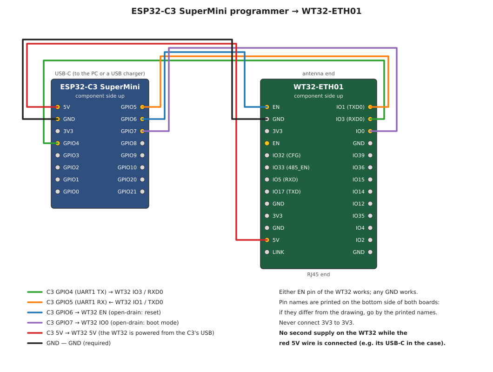
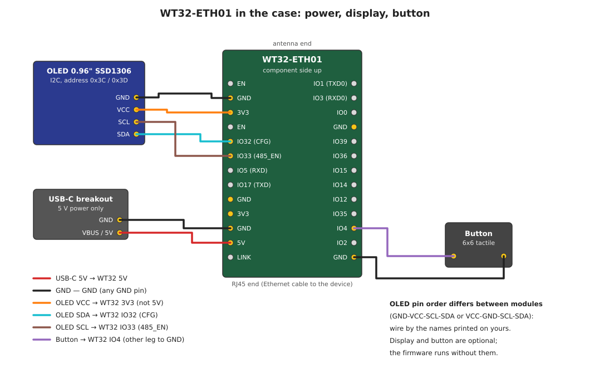

# Wiring and first flash

*[Українська](WIRING_UA.md)*

How to wire the ESP32-C3 SuperMini programmer to the WT32-ETH01, flash it the first time, and then wire the WT32 on its own (power, display, button). The diagrams are generated by [`wiring/gen_wiring.py`](wiring/gen_wiring.py).

> Section 1 (programmer → WT32) and the first flash (section 2) are verified on hardware. Section 4 (display, button, USB-C in the case) is not yet: its pin order comes from the WT32-ETH01 datasheet v1.4 and [egnor/wt32-eth01](https://github.com/egnor/wt32-eth01). Both boards have the pin names printed on them: if a name differs from the drawing, go by the printed name.

## 1. Programmer → WT32



| C3 SuperMini | WT32-ETH01 | Why |
|---|---|---|
| GPIO4 (UART1 TX) | IO3 / RXD0 | data to the WT32 |
| GPIO5 (UART1 RX) | IO1 / TXD0 | data and log from the WT32 |
| GPIO6 | EN (either of the two) | reset; open-drain: the C3 only pulls it low or lets go |
| GPIO7 | IO0 | boot mode; open-drain, released after start (IO0 is the Ethernet clock input) |
| 5V | 5V | for flashing and the log only (see the power note below) |
| GND | GND (any) | required |

- **Never connect 3V3 to 3V3.** The C3 must never drive IO0 high; the firmware only pulls it low.
- **Only one 5V source.** While the red 5V wire is connected, do not power the WT32 from anything else (e.g. its USB-C in the case). To keep the programmer attached to a WT32 that has its own power, disconnect only the 5V wire; GND stays.
- **Power: the programmer's 5V is enough for flashing and the log, not for running.** Powered from the C3's 5V pin with the C3 on a PC USB port, the WT32 (any firmware version) brownout-resets in a loop about 2.4 s after boot, right when the Wi-Fi station starts with the Ethernet link up: the log shows `E BOD: Brownout detector was triggered`, then a reset. Without the Ethernet cable it may run (seen on 0.8.2), and turning the C3's own Wi-Fi off does not help. The dip comes at start-up, when the radio calibrates while the link is up: on the same supply, a cable plugged in after the WT32 had booted kept the link up for over 20 min without a reset (0.8.4). That is a stopgap for the bench, not a power supply. To run the firmware with Wi-Fi and Ethernet, give the WT32 its own 5 V supply (1 A or more suggested), remove the red 5V wire, and keep only GND and the four signal wires to the C3.

## 2. First flash

1. Flash the C3 and connect it to Wi-Fi: [C3 programmer README](../tools/c3-programmer/README.md), steps 1–2. Its page is at `http://c3prog.local`.
2. Wire the C3 to the WT32 as above and plug the C3 into USB. The WT32 power LED lights up.
3. Check the connection:
   ```bash
   esptool.py --chip esp32 -p rfc2217://c3prog.local:4000 flash_id
   ```
   It should print the chip (ESP32-D0WD…) and the flash size (4 MB). If it cannot connect, swap the TX/RX wires first. If auto-reset fails, press **Download mode** on the C3 page and add `--before no_reset`.
4. The first time, erase the flash (it holds the factory AT firmware), then write the full image:
   ```bash
   esptool.py --chip esp32 -p rfc2217://c3prog.local:4000 erase_flash
   esptool.py --chip esp32 -p rfc2217://c3prog.local:4000 write_flash 0x0 wt32/firmware/wt32-bridge.bin
   ```
5. Watch the log (`--rts 0 --dtr 0` is required, otherwise the WT32 stays in reset):
   ```bash
   python -m serial.tools.miniterm --rts 0 --dtr 0 rfc2217://c3prog.local:4000 115200
   ```
   After the boot messages there is a summary line every 10 s; with a display attached, the log also says `SSD1306 at 0x3C` (or `0x3D`).
6. Connect a phone to the **`WT32-Setup-XXXX`** access point → http://192.168.4.1 (page password `12345678`) and choose the mode. Then go through the checklist in [`wt32/README.md`](../wt32/README.md).

If `.local` names do not resolve (common on Windows without Bonjour), use the C3's IP from its status page or your router.

### Troubleshooting

- **The WT32 restarts every few seconds, `Brownout detector was triggered` in the log:** it is powered from the programmer's 5V. Give it its own 5 V supply (see the power note in section 1).
- **esptool or miniterm loses the connection on a reset, and afterwards the WT32 stays in reset and the C3 accepts no new connection:** the PC that runs esptool/miniterm also has a wired interface behind the WT32 (for example when testing with the PC as the device), and the OS routes the RFC2217 connection through the WT32 (on Windows, Ethernet often has metric 5 against Wi-Fi's 35). The RTS reset then cuts the connection that carries it. The C3 then keeps EN low, so the WT32 stays in reset, and it accepts no new client until it is restarted (BOOT 5–10 s, or a USB reset); since C3 0.4.2 it releases EN after ~3 s (verified: the WT32 is back in 6–10 s), and C3 0.4.5 accepts the next client 15–17 s after the reset (verified; on 0.4.2–0.4.4 it took from 31 s to over a minute, see the C3 README). To avoid it, make the PC reach the C3 through the other interface: bind the client to it or add a host route to the C3's address.

## 3. After flashing: with or without the programmer

- **Keep it attached** to see the log and to reflash over Wi-Fi. The C3 releases EN and IO0, so the WT32 runs normally.
- **Take it off:** unplug the six wires and power the WT32 on its own (section 4). Later updates go through the WT32 web page: **Firmware** section, **Update firmware** with `wt32/firmware/wt32-bridge-ota.bin`, with rollback if the new firmware does not start. The cable is only needed again if the WT32 cannot boot at all.

## 4. WT32 on its own (in the case)



| From | WT32-ETH01 | Note |
|---|---|---|
| USB-C breakout VBUS / 5V | 5V | a "power only" USB-C breakout |
| USB-C breakout GND | GND | |
| OLED VCC | **3V3** | not 5V: some modules pull the I2C lines up to their supply |
| OLED GND | GND | |
| OLED SDA | IO32 (printed CFG) | |
| OLED SCL | IO33 (printed 485_EN) | |
| Button, one leg | IO4 | internal pull-up, no resistor |
| Button, other leg | GND | |

- The OLED's pin order differs between modules (GND-VCC-SCL-SDA or VCC-GND-SCL-SDA): wire by the names printed on yours.
- The display and the button are optional. What the button does (short press, 5 s, 10 s) is described in [`wt32/README.md`](../wt32/README.md).
- The green LED on the RJ45 jack stays lit with no cable plugged in, even while the WT32 sits in its ROM bootloader (no firmware running): it is the board's wiring of the Ethernet chip's LED pins, not a link. The link state is in the log (`eth: link up …` / `eth down`) and on the display's Device page.
- In the case the wires are soldered to the pins; Dupont connectors do not fit in height (see [`hardware/case/README.md`](../hardware/case/README.md)).
