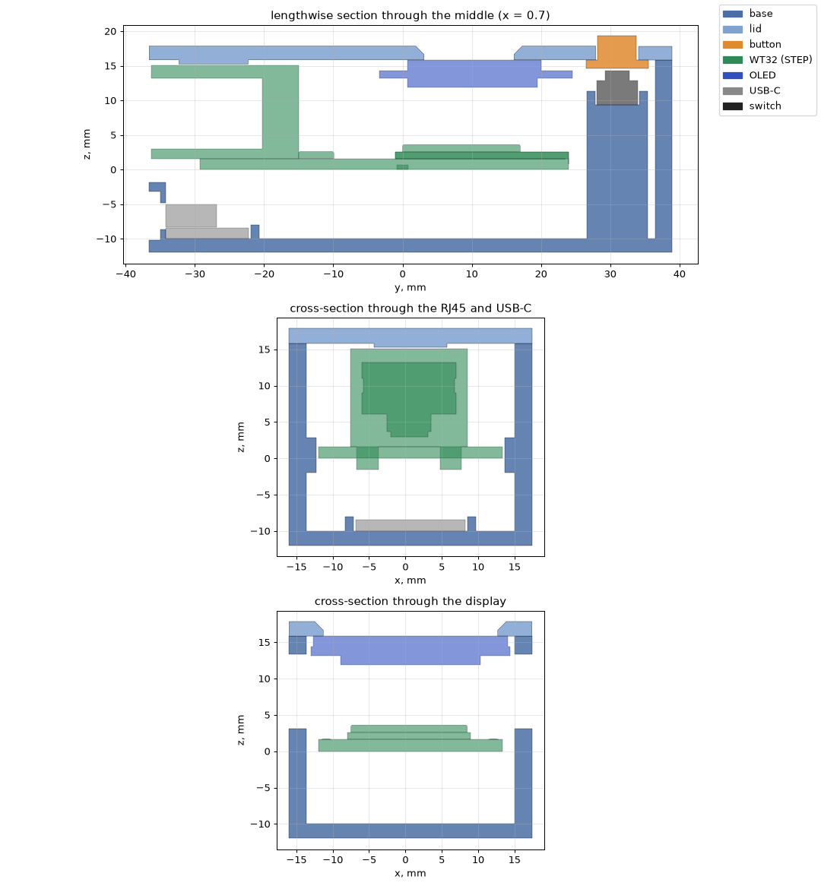
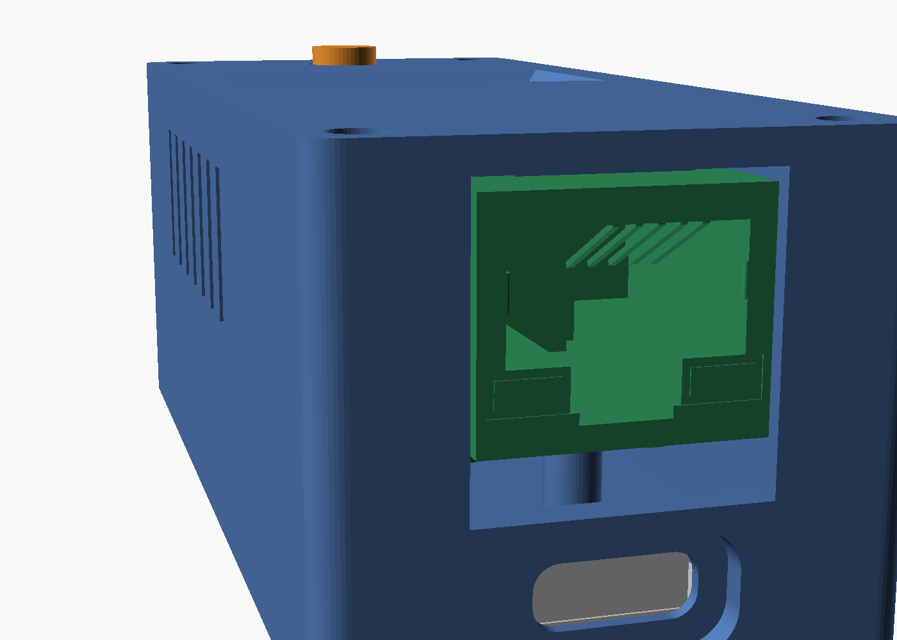
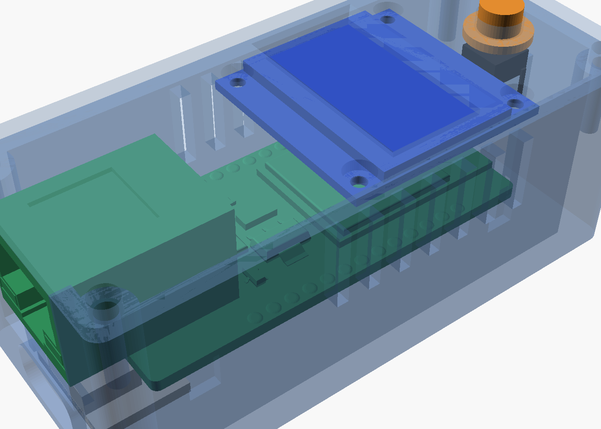
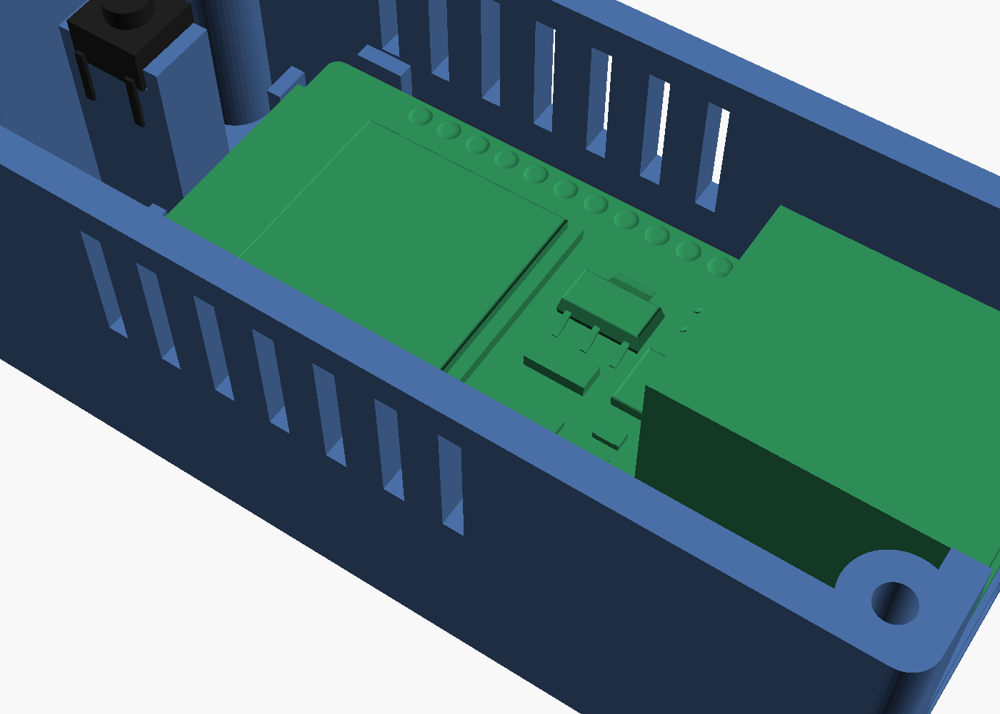
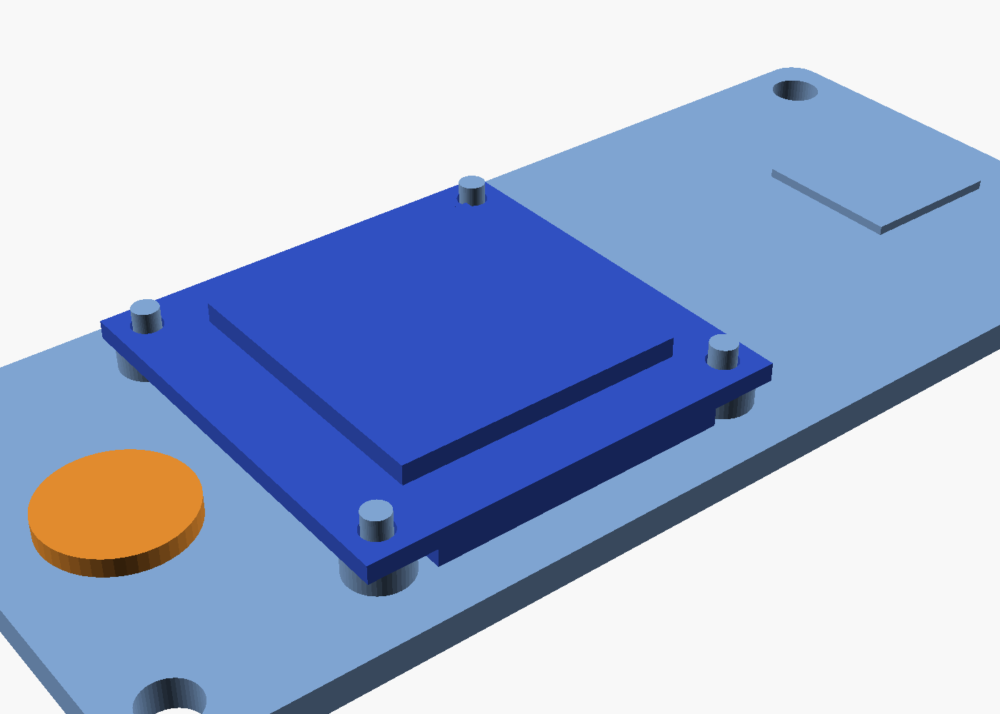

# WT32 case

*[Українська](README_UA.md)*

A case for the WT32-ETH01 with a 0.96″ OLED display, one button and USB-C power. The model is described in code: [`build_case.py`](build_case.py) using [manifold3d](https://github.com/elalish/manifold) (boolean operations, always a closed mesh). Ready-made STLs are already in [`stl/`](stl/), oriented for printing.

| Outside | Sections |
|---|---|
|  |  |
|  |  |
|  |  |

Outer size: 33.4 × 75.5 × 29.9 mm with the lid.

## Where the dimensions come from

- **WT32-ETH01**: from the 3D model in [egnor/wt32-eth01](https://github.com/egnor/wt32-eth01), file `WT32-ETH01.step` (pinned commit). The dimensions match the KiCad footprint in the same repository and the 60 × 26 × 17 mm overall size given there.
  - Board 25.4 × 53.26 × 1.6 mm.
  - RJ45 16 × 21.3 mm, sticks out 7 mm past the board edge and reaches 1.5 mm below the board. Top of the RJ45 is 15.05 mm above the bottom of the board.
  - The WT32-S1 module with the antenna sits at the other end, 3.6 mm tall from the bottom of the board.
  - Pins 2 × 13 at 2.54 mm pitch, rows 22.86 mm apart.

  That repository has no license, so the board model is not copied here: `build_case.py --step` downloads it itself, for checking only.
- **OLED, 6×6 tactile switch, USB-C breakout**: typical dimensions; there are no 3D models of these modules. **Check them against yours** (table below).

## What is inside

| Where | What |
|---|---|
| −y end | RJ45 (its front 0.3 mm behind the wall face); USB-C below it, with a recess outside for the plug |
| Floor | WT32 on 4 posts: board bottom 10 mm above the floor to leave room for the pins (if soldered facing down) and wires. Side guides and the end stop sit outside the pin rows |
| Under the board | USB-C breakout on the floor between guides, under the RJ45 overhang (~1.6 mm to the RJ45 pins) |
| Lid | display window with a chamfer; display on 4 pegs, glass against the lid (~8 mm to the WT32 board below), peg ends stick out 1.2 mm above the display board to be melted over with a soldering iron; a rib holds the RJ45 down |
| +y end | button: tactile switch in a pocket on a post rising from the floor; two low walls hold the switch body, and its legs hang down past the sides of the post so wires can be soldered to them; plunger through the lid. The ESP32 antenna is at this end, with only plastic around it |
| Sides | vent slots above the board |

## Checks

After every build, `build_case.py` checks that:

- each part is one closed solid;
- the case parts do not overlap each other or anything inside: the WT32 board with its pins, the display, the USB-C breakout, the tactile switch, the screws;
- with `--step`, the same is checked against the real board model: 41 solids;
- minimum clearances:
  - RJ45 to its opening ≥ 0.3 mm, to the lid ≥ 0.15 mm;
  - board to the walls and guides ≥ 0.25 mm;
  - display to the board's parts ≥ 2 mm;
  - USB-C breakout to the RJ45 pins ≥ 0.8 mm;
  - switch body between the walls on its post: 0.05–0.4 mm; switch legs to the sides of the post ≥ 0.3 mm;
  - plunger in its hole and above the switch;
- walls and ribs are at least 1.2 mm thick (3 perimeters of 0.4), by ray scanning. Only two places are intentionally thinner: the 0.8 mm wall in front of the USB-C receptacle, so the plug goes all the way in, and the 0.8 mm straight land of the window under the chamfer;
- overhangs in print orientation: only short bridges (tops of the USB-C openings and slots) and ledges up to 1.3 mm;
- the print STLs, turned back into place, match the assembly, i.e. nothing is mirrored.

Result: [`check_report.txt`](check_report.txt), 52 checks, all ok.

This checks the model, not a printed case. Not yet tested with real boards and a printer.

## You need

- WT32-ETH01, 0.96″ I2C OLED (SSD1306), 6×6 tactile switch 5 mm tall.
- A "power only" USB-C breakout: 5 V wire to the WT32's 5V pin, GND to GND.
- 4 M3 × 8–10 self-tapping screws with pan or cheese heads.
- Double-sided tape (posts under the WT32, USB-C breakout), a drop of hot glue (switch in its pocket on the post; display pegs, if not melted).
- Thin wires soldered directly to pins or pads:
  - **display without the pin header**, or with its pins clipped;
  - Dupont connectors do not fit in height.

## Printing

| Part | Orientation |
|---|---|
| `wt32_case_base.stl` | floor down |
| `wt32_case_lid.stl` | face down, window chamfer at the bottom |
| `wt32_case_button.stl` | flange down |

- No supports needed.
- PETG (or PLA), 0.2 mm layers, 3 perimeters, 20–30 % infill.

## Assembly

1. Solder the wires:
   - OLED → 3V3, GND, IO32 (SDA), IO33 (SCL);
   - button → IO4 and GND (on the legs that hang down past the sides of the post);
   - USB-C → 5V and GND.
2. Place the USB-C breakout on the floor between the guides, receptacle against the wall, and fix it with tape.
3. Put the tactile switch into the pocket on the post near the +y end, between the two low walls, actuator up, legs along the sides of the post; fix it with a drop of glue.
4. Lower the WT32 onto the posts (with double-sided tape on them), RJ45 into its opening.
5. Press the display glass-first against the lid with the pegs through its holes; melt over the peg ends that stick out 1.2 mm above the display board with a soldering iron (or fix them with a drop of glue).
6. Insert the plunger into the lid from below, flange inside.
7. Close the lid and drive in the 4 screws.

## Check before printing

Parameters at the top of `build_case.py`:

| Parameter | Current | What it is |
|---|---|---|
| `OLED` `w`, `h` | 27.3 × 27.8 | display board (header towards +y) |
| `OLED` `hole_d`, `hole_in` | 2.0; 2.0 from the edges | display mounting holes |
| `OLED` `glass` | 1.5 | glass + tape: from the glass face to the display board |
| `OLED` `win_dy` | −1.0 | offset of the visible area from the centre of the display board |
| `USB` `w`, `d`, `z` | 15 × 12, receptacle centre 3.3 mm above the floor | USB-C breakout |
| `SW` | 6 × 6, 5 mm tall | tactile switch |
| `UNDER` | 10 | WT32 bottom above the floor: less if the board has no pins |

After changing a parameter, rebuild. If any check shows `FAIL`, the report says what collided with what.

## Rebuilding

```bash
pip install manifold3d trimesh numpy scipy networkx     # + cadquery-ocp for --step, matplotlib for --render
python3 build_case.py                   # STLs + checks with stand-ins
python3 build_case.py --step            # + the real WT32-ETH01 model
python3 build_case.py --step --render   # + images into img/ (needs openscad; without a display: xvfb-run)
```
