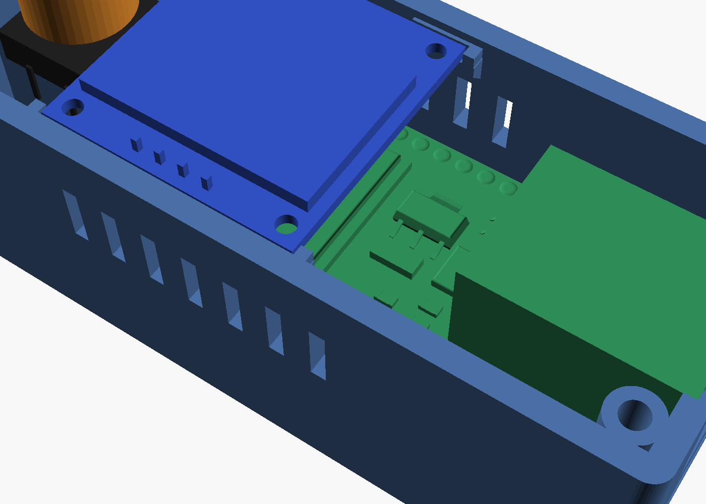

# WT32 case

*[Українська](README_UA.md)*

A case for the WT32-ETH01 with a 0.96″ OLED display, one button and USB-C power. The model is described in code: [`build_case.py`](build_case.py) using [manifold3d](https://github.com/elalish/manifold) (boolean operations, always a closed mesh). Ready-made STLs are already in [`stl/`](stl/), oriented for printing.

| Outside | Sections |
|---|---|
|  |  |
|  |  |
|  |  |
|  | |

Outer size: 33.9 × 79.6 × 30.8 mm with the lid.

## Where the dimensions come from

- **WT32-ETH01**: from the 3D model in [egnor/wt32-eth01](https://github.com/egnor/wt32-eth01), file `WT32-ETH01.step` (pinned commit). The dimensions match the KiCad footprint in the same repository and the 60 × 26 × 17 mm overall size given there.
  - Board 25.4 × 53.26 × 1.6 mm; with the RJ45 60.3 mm long.
  - RJ45 16 × 21.3 mm, sticks out 7 mm past the board edge; only its pegs, shield tabs and pins reach 1.5 mm below the board, behind the board edge. The part past the edge ends at the board top.
  - The WT32-S1 module with the antenna sits at the other end, 3.6 mm tall from the bottom of the board.
  - Pins 2 × 13 at 2.54 mm pitch, rows 22.86 mm apart.

  That repository has no license, so the board model is not copied here: `build_case.py --step` downloads it itself, for checking only.
- **OLED, 12 × 12 tactile switch with a round cap, USB-C breakout**: typical dimensions; there are no 3D models of these modules. **Check them against yours** (table below).

## What is inside

| Where | What |
|---|---|
| −y end | RJ45: its front rests against two lips at the sides of the opening, 1.25 mm behind the wall face (the lips cover 0.6 mm of its face at each side; its port and LEDs stay clear), so it sets the board's place along the case; the opening goes down to 0.4 mm under the jack. USB-C below it, with a recess outside for the plug |
| Floor | WT32 on 6 posts: board bottom 10 mm above the floor to leave room for the pins (if soldered facing down) and wires; two of them under its corners at the RJ45 end, so pressing on the jack does not lever the board up. Side guides and the end stops sit outside the pin rows. The end stops are 1.6 mm plates from the floor at the board's far corners, beside the WT32-S1 module. On each, a bump under the board's top reaches 0.2 mm into its end: the plates flex and press the jack against its lips, so the board does not move lengthwise. Above it, a hook reaches 0.8 mm over the board's top, 0.1 mm above it: the board snaps in under the hooks and cannot lift. It keeps 1.2 mm to the screw bosses at the RJ45 end |
| Under the board | USB-C breakout on the floor between guides, under the RJ45 overhang (~1.6 mm to the RJ45 pins) |
| Above the board | display, turned by 90°: the text runs along the case, towards the button (RJ45 on the left, button on the right), its pin pads face the −x wall. It lies on 4 ledges of the side walls, at both ends of the display and not under its pin pads, 0.95 mm under each edge, between stops at its ends and ribs on the walls (0.25 mm around it); the WT32 still goes in past them from the top. The glass reaches 0.6 mm into a 0.8 mm pocket of the lid (0.2 mm above and around it), so the display cannot slide and the closed lid keeps it on the ledges; the pocket goes on over its 4 header pins (clipped as tall as the glass), out to the wall, with the same 0.2 mm above them (~8 mm from the display's back to the WT32's parts) |
| Lid | 2.9 mm thick, held by 4 countersunk M3 screws in the corners (heads flush, thread cut in the bosses of the base); window with a chamfer over the visible area, which sits 2.8 mm off the module's centre towards its pin pads (measured: ~4.2 mm from that edge, ~9.8 mm from the other); a rib holds the RJ45 down; 12.0 mm hole for the button cap. Underneath, along both long walls, lips with a triangular section (0.6 mm tall, 1.2 mm at the root, the vertical face 0.2 mm from the wall, so they do not snap off); they end 0.2 mm from the corner bosses, so the lid cannot shift either across or along the case, and pause over the display pins |
| +y end | button: 12 × 12 tactile switch on a post rising from the floor; two low walls hold its body, and its legs hang down past the sides of the post so wires can be soldered to them. Its own round cap comes out through the lid, 1.2 mm above it. The ESP32 antenna is at this end, with only plastic around it |
| Sides | vent slots above the board, under the ledges |

## Checks

After every build, `build_case.py` checks that:

- each part is one closed solid;
- the case parts do not overlap each other or anything inside: the WT32 board with its pins, the display, the USB-C breakout, the switch with its cap, the screws;
- with `--step`, the same is checked against the real board model: 41 solids;
- minimum clearances:
  - RJ45 to its opening ≥ 0.3 mm apart from the lips it rests against (the opening ends 0.4 mm under the front of the jack), to the lid ≥ 0.15 mm;
  - lengthwise: ≥ 0.8 mm from the board to the screw bosses; the end stops' bumps press into its far end and clear the WT32-S1 module;
  - the board held down: the end-stop hooks 0.1 mm over its top, reaching ≥ 0.6 mm over it; all posts under the board;
  - board to the walls and guides ≥ 0.25 mm; the WT32 goes in from the top past the ledges and bosses with ≥ 0.25 mm;
  - display to the board's parts ≥ 2 mm;
  - USB-C breakout to the RJ45 pins ≥ 0.8 mm;
  - switch body between the walls on its post: 0.05–0.4 mm; switch legs to the sides of the post ≥ 0.3 mm;
- the display lies on the ledges (≥ 0.8 mm of each under it, its pin pads clear), 0.25 mm from its stops and ribs, and its glass in the lid pocket (0.2 mm above and around it);
- the lid lips 0.2 mm from the walls and the corner bosses, clear of the display; the display's header pins in their recess of the lid (≥ 0.15 mm above them);
- the button cap in its lid hole (radial gap ≥ 0.05 mm), the switch body under the lid (≥ 0.15 mm), the cap ≥ 0.5 mm above the lid;
- the lid screws (ISO 10642 M3 × 8): countersink as deep as the head (flush), ≥ 1 mm of lid under it, ≥ 4 mm of thread in the boss, countersink ≥ 1 mm from the outer faces;
- walls and ribs are at least 1.2 mm thick (3 perimeters of 0.4), by ray scanning. Only these places are intentionally thinner: the 0.8 mm wall in front of the USB-C receptacle, so the plug goes all the way in, the 0.8 mm straight land of the window above the glass pocket, the 1.0 mm rim between a countersink and the outer faces at the lid surface, the 1.04 mm of lid under the screw heads (pressed onto the bosses) and the lips, which taper to an edge;
- overhangs in print orientation: only short bridges (tops of the USB-C openings and slots) and ledges up to 1.6 mm; the display ledges have 45° corbels under them;
- the print STLs, turned back into place, match the assembly, i.e. nothing is mirrored.

Result: [`check_report.txt`](check_report.txt), 52 checks, all ok.

This checks the model, not a printed case. Not yet tested with real boards and a printer.

## You need

- WT32-ETH01, 0.96″ I2C OLED (SSD1306), a 12 × 12 tactile switch 8 mm tall to the top of its stem, with a round cap on it: 13 mm to the top of the cap, up to 11.5 mm across.
- A "power only" USB-C breakout: 5 V wire to the WT32's 5V pin, GND to GND.
- 4 countersunk hex socket screws ISO 10642 M3 × 8 (e.g. K3x8 ISO 10642 A2) and a 2 mm hex key. They cut their own thread in the 2.6 mm holes of the corner bosses.
- Double-sided tape (USB-C breakout; none under the WT32: the hooks hold it, and tape would lift it into them), a drop of hot glue (switch on its post).
- Thin wires soldered directly to pins or pads:
  - **display without the pin header**, or with its pins clipped as tall as the glass (the lid has a recess over them);
  - Dupont connectors do not fit in height.

## Printing

| Part | Orientation |
|---|---|
| `wt32_case_base.stl` | floor down |
| `wt32_case_lid.stl` | face down, window chamfer at the bottom |

- No supports needed.
- PETG (or PLA; PETG takes the bending of the end-stop hooks better), 0.2 mm layers, 3 perimeters, 20–30 % infill.

## Assembly

1. Solder the wires:
   - OLED → 3V3, GND, IO32 (SDA), IO33 (SCL);
   - button → IO4 and GND (on the legs that hang down past the sides of the post);
   - USB-C → 5V and GND.
2. Place the USB-C breakout on the floor between the guides, receptacle against the wall, and fix it with tape.
3. Put the switch onto its post near the +y end, between the two low walls, cap up, legs along the sides of the post; fix it with a drop of glue.
4. Put the WT32 in RJ45 end first: the jack into its opening, against the lips. Then press the antenna end down onto the posts until the two hooks at that end snap over the board. It passes between the display ledges. To take it out, push the hooks' plates towards the button and lift that end.
5. Lay the display on the 4 ledges, glass up, its pin pads towards the side wall on the left as seen from the RJ45 end: the text then reads along the case, towards the button.
6. Close the lid (the glass goes into its pocket, the button cap through its hole) and drive in the 4 screws until the heads sit flush. The first time they cut their thread in the plastic: turn them in slowly and do not overtighten.

## Check before printing

Parameters at the top of `build_case.py`:

| Parameter | Current | What it is |
|---|---|---|
| `OLED` `w`, `h` | 27.3 × 27.8 | display board: along the text × across it (pin pads at the top edge) |
| `OLED` `glass` | 1.5 | glass + tape: from the glass face to the display board |
| `OLED` `win_dy` | 2.8 | offset of the visible area from the centre of the display board, across the text (+: towards the pin pads) |
| `OLED_PINS` | 7.5–20.0 | where the pin pads are along the text: no ledge under them, the lid's recess over them (from the pin edge to the glass) |
| `OLED_HDR` | 1.5 from the pin edge, 2.54 pitch | the 4 header pins, for the checks |
| `GLASS_IN`, `OLED_POCKET` | 0.6; 0.8 | the glass face above the lid underside (sets the display's height); depth of its pocket in the lid |
| `LEDGE` | 6 mm long, 0.25 mm clear of the WT32 | the display ledges |
| `SW` | 12 × 12, body 3.8, stem 8, 13 mm to the cap top, cap 11.4 | tactile switch; the post is set so the cap stands `CAP_PROUD` (1.2 mm) above the lid |
| `BTN_HOLE` | 12.0 | hole for the cap in the lid |
| `LIP` | 0.6 tall, 1.2 at the root, 0.2 from the walls | the lid lips |
| `USB` `w`, `d`, `z` | 15 × 12, receptacle centre 3.3 mm above the floor | USB-C breakout |
| `UNDER` | 10 | WT32 bottom above the floor: less if the board has no pins |
| `RJ_RECESS`, `RJ_LIP` | 1.25; 0.6 | RJ45 front behind the wall face (the lips' depth); how much the lips cover |
| `END_STOP` | 0.5 gap, 0.7 bump, 1.0 hook, 0.1 clear, 1.6 thick | end stops past the board's far end: the bumps reach 0.2 mm into it, the hooks 0.8 mm over its top |
| `DISP_GAP` | 0.25 | display to its stops and ribs |
| `SCREW`, `SCREW_PILOT` | ISO 10642 M3 × 8; 2.6 | lid screws (the length includes the head); the hole they cut their thread in: smaller holds tighter, larger turns in easier |

After changing a parameter, rebuild. If any check shows `FAIL`, the report says what collided with what.

## Rebuilding

```bash
pip install manifold3d trimesh numpy scipy networkx rtree   # + cadquery-ocp for --step, matplotlib for --render
python3 build_case.py                   # STLs + checks with stand-ins
python3 build_case.py --step            # + the real WT32-ETH01 model
python3 build_case.py --step --render   # + images into img/ (needs openscad; without a display: xvfb-run)
```

If `openscad` is not on PATH (e.g. the portable Windows zip), point `OPENSCAD` at its executable (`openscad.com` on Windows).
